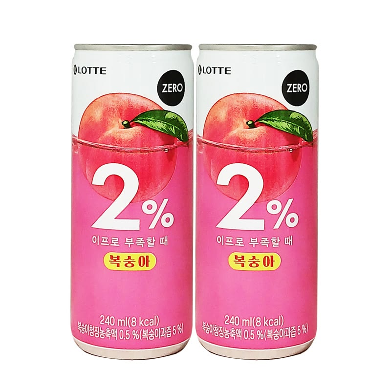
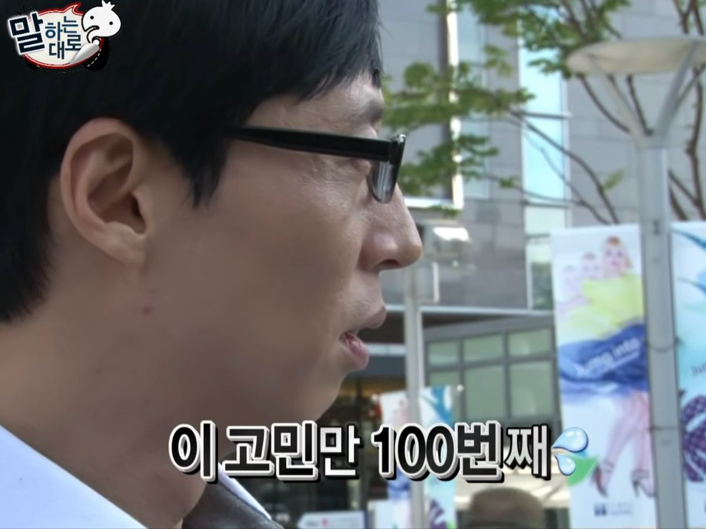
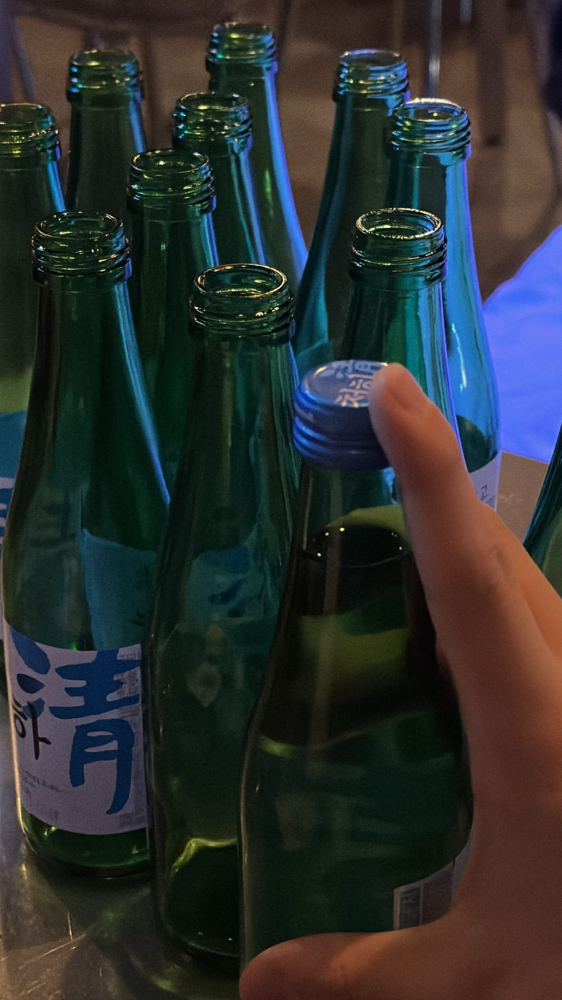
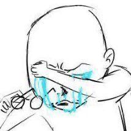

# yoon-html[yoon.html](https://github.com/user-attachments/files/26039912/yoon.html)
<!DOCTYPE html>
<html lang="ko">
<head>
    <meta charset="UTF-8">
    <meta name="viewport" content="width=device-width, initial-scale=1.0">
    <title>눈물고백</title>
    
</head>
<body>

    <header>
        <h1>모쏠탈출기</h1>
        
이상형 리스트와 8개월의 거짓말이 만든 기적

    </header>

    <section>
        <h2>#1. 내가 모쏠이었던 이유</h2>
        
사실 나는 20살까지 모쏠이었다. 이유를 꼽아보자면 일단 내 이상형이 남들에 비해 좀 특이한 편이기도 했고, 무엇보다 여고를 나와서 주변에 남자인 친구가 아예 없었기 때문이다.

        
그렇게 대학교에 입학하고, 사진동아리에 들어갔다. 대학 생활의 낭만을 꿈꾸며 신청한 첫 정기 출사. 나는 금요일 공강이라 설레는 마음으로 금요일 팀에 합류하게 되었다.

        
        
        
        
약속 장소는 덕수궁. 총 5명이 모이기로 했는데, 한 명이 약속 시간이 지나도록 나타나지 않았다. 다들 어색하게 서서 기다리던 그때, 저 멀리서 한 남자가 숨을 헐떡이며 뛰어왔다. 지금의 내 남자친구였다.

        
그는 너무 미안하다며 곧장 편의점으로 달려가더니 우리 모두를 위해 음료수를 사 왔다. 나에게 다가와 "무슨 음료를 먹고 싶으세요?"라고 물었고, 나는 "이프로요"라고 답했다. 

        
그렇게 내 손에 들린 이프로 캔 하나. 미안해하며 팀원들을 챙기는 그의 태도를 보고, 나는 속으로 이미 <b>+10점</b>을 주었다. 첫인상이 참 바른 사람이라는 생각이 들었기 때문이다.

        
        
    </section>

    <section>
        <h2>#2. 8개월의 공백</h2>
        
덕수궁 출사를 하며 막 꽃이 피는 나무들을 찍느라 시간 가는 줄 몰랐다. 그러다 보니 내 핸드폰 배터리가 바닥을 보였다. 그때 그가 나에게 다가와 "제 보조 배터리 쓰실래요?"라며 친절을 베풀었다. 감사하다고 말하며 연결했지만... 아쉽게도 배터리는 작동하지 않았다. 지금 생각하면 그 어설픈 모습조차 운명이었나 싶다.

        
출사를 마치고 밥을 먹으며 대화를 나누는데, 놀라운 사실을 발견했다. 그가 내 '이상형 리스트'에 하나하나 들어맞고 있었던 것이다.

        
        

            
<strong>내 이상형 리스트:</strong> 
            1. INTJ일 것 2. 말을 예쁘게 하는 사람 3. 지식이 많고 똑똑함 4. 적당한 아랍상 5. 웃을 때 치아가 고른가 6. 글씨 잘 쓰는 사람 

        

        
        
그는 이 모든 것에 부합했다. 원래 나는 외향적인 성격이지만, 첫 출사의 긴장감 때문인지 그날은 내향인이 되어버렸다. 친해지고 싶었지만 끝내 마음을 전하지 못한 채 집으로 돌아왔다. 카톡을 보낼까 말까 100번쯤 고민하다 결국 포기했다. 그 후 출사에서도 그와 시간이 엇갈리며 우리의 인연은 그렇게 끝나는 듯했다.

        
        
    </section>

    <section>
        <h2>#3. 11월과 인연</h2>
        
8개월이 지난 11월, 학생회 선배 언니와 술자리에서 우연히 이야기하게 되다, 그 언니가 사진동아리이고 지금의 남자친구가 절친의 절친이라는 사실을 알게 되었다. 내가 그 사람 괜찮은 것 같다고 하자마자 소개를 시켜주겠다고 하였고, 결국 그 언니의 주선으로 소개팅을 하게 되었다. 여기에는 엄청난 비하인드가 있었다.

        
        

            
💡 알고 보니!

            
그는 인생에서 단 한 번도 소개팅을 나가본 적이 없는 사람이었다. 그런데 그 언니가 나를 소개해주려 할 때, <strong>"그 애(나)가 먼저 너 소개시켜달라고 했어!"</strong>라고 말해버린 것이다.

            
게다가 언니는 내가 8개월 동안 그를 짝사랑하며 구구절절 사랑해왔다고 엄청난 '사랑의 거짓말'을 보탰다. 그는 자기를 먼저 궁금해해 준 내가 누군지 궁금해서, 생애 첫 소개팅에 나오게 되었다고 한다.

        

        
        
하지만 정작 소개팅 당일에는 관심 분야가 너무 달라 대화가 툭툭 끊겼다. 나는 '역시 안 되나 보다' 싶어 애프터를 거절하듯 마무리했다. 그런데 반전은 카톡에서 일어났다. 만나서 못다 한 이야기들이 카톡으로는 끊임없이 이어졌고, 우리는 서서히 서로에게 다시 젖어 들기 시작했다.

    </section>

    <section>
        <h2>#4. 12월 25일, 눈물과 고백</h2>
        
크리스마스 이브, 우리는 영화를 보고 술을 마시게 되었다. 어느덧 막차가 끊겼고, 우리는 "첫차까지 마시자"며 속 깊은 이야기를 나눴다.

        
        

        
평소 감정 표현이 적은 '극 T' 성향인 그가 자신의 어린 시절 이야기를 들려주기 시작했다. 나는 그의 이야기에 진심으로 공감하며 반응해주었다. 그런데 갑자기 그가 눈물을 흘리기 시작했다.

        
        

        
당황해서 왜 우냐고 묻자, 그는 "태어나서 내 이야기를 이렇게 자세히 해본 게 처음이야. 네가 내 마음을 알아주는 것 같아서 감정이 올라와."라고 말했다.

        
눈물이 그치자 그는 머릿속에 한 단어밖에 안 떠오른다며 말했다. <b>"우리 만나볼래?"</b>

        
나는 잠시 화장실에 가서 숨을 고르며 고민했다. '그래, 이 사람이다.' 다시 자리로 돌아가 그의 제안을 수락했다. 시계를 보니 12시가 넘어 이미 12월 25일 크리스마스였다. 모쏠이었던 나의 세상에 가장 특별한 크리스마스 선물이 도착한 순간이었다.

    </section>

    <footer>
        
© 2026. 모쏠탈출 성공기.

    </footer>

</body>
</html>
